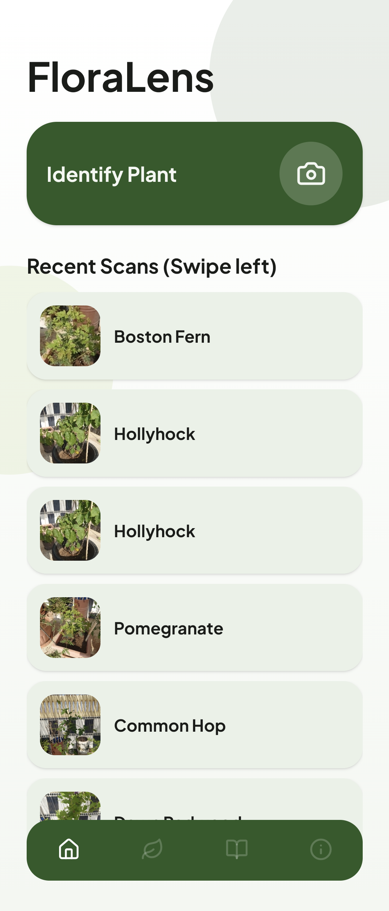
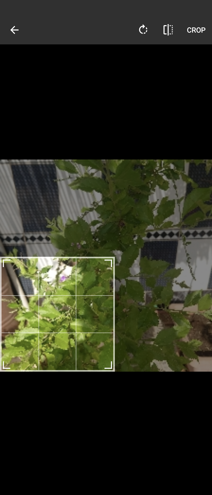
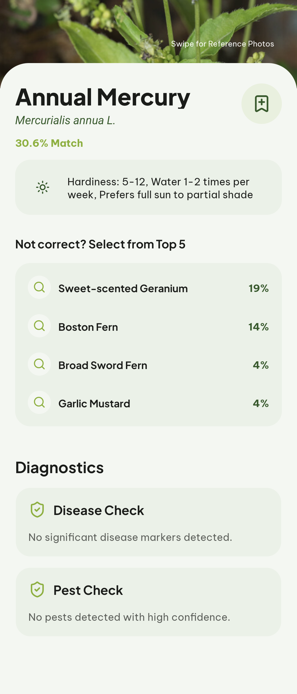
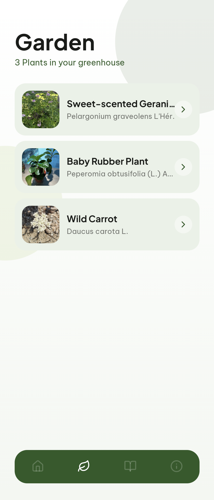
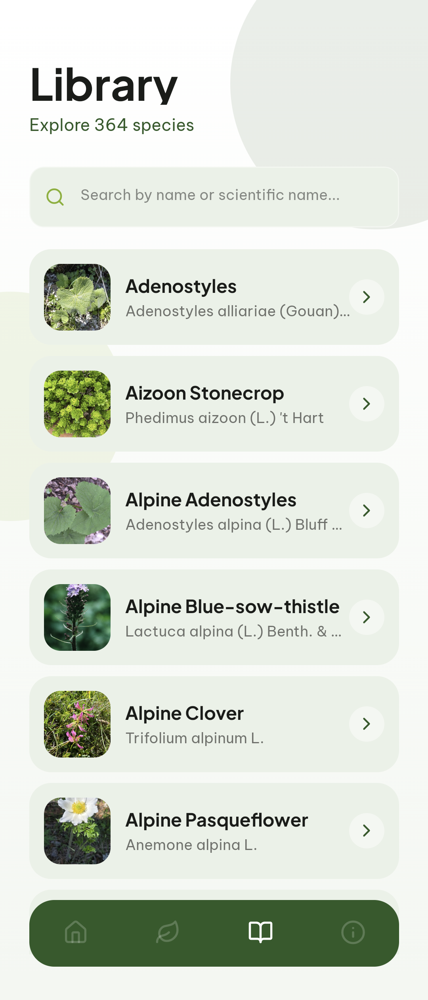

# FloraLens

FloraLens is an Android application that performs fully offline plant identification, pest classification, and disease segmentation using on-device AI models.

<div align="center">
  
  
  
  
  
</div>

## Features

- **Entirely Offline Inference**: Using `onnxruntime-react-native`, models execute directly on the Android hardware via C++ bindings. No servers, no API costs, and total data privacy.
- **Multi-Model Pipeline**:
  - **Plant ID**: (From my other project [flora](https://github.com/abderrahmenex86/flora)) 224x224 Classification with Softmax top-5 graceful degradation.
  - **Pest ID**: (from my other project [pesti](https://github.com/abderrahmenex86/pesti)) Confidence-thresholded insect detection.
  - **Disease Segmentation**: (from my other project [segmenti](https://github.com/abderrahmenex86/segmenti)) 520x520 spatial mask generation with in-memory RGBA tinting for visual overlays.
- 💾 **Synchronous Storage**: using `react-native-mmkv` to manage the user's digital garden and scan history.

<div align="center">
  <p><strong>On-device AI plant identification, disease segmentation, and garden management.</strong></p>
  <p>
    
    
    
    
  </p>
</div>

## Tech Stack

- **Machine Learning:** ONNX Runtime, `jpeg-js`, PyTorch-identical preprocessing (Resize, CenterCrop, Normalize)
- **Frontend Framework:** React Native / Expo (SDK 54) / Expo Router
- **Styling:** NativeWind (Tailwind CSS)
- **Storage & FileSystem:** React Native MMKV, Expo File System
- **Animations & Gestures:** React Native Reanimated, Gorhom Bottom Sheet, React Native Gesture Handler

## Getting Started

### Prerequisites
- Node.js (v18+)
- Expo CLI
- Android Emulator or a physical Android device (USB Debugging enabled)

### Installation

1. **Clone the repository:**
```bash
git clone https://github.com/abderrahmenex86/floralens.git
cd floralens
```
2. **Install dependencies:**
```bash
npm install
```
3. **Add your AI Models & Assets:**
Ensure your `.onnx` models are placed in `assets/models/`.
Ensure your reference images are placed in `assets/images/plants/`.

4. **Build and Run (Android):**

*Because this project utilizes custom native code (ONNX, MMKV), it cannot run in Expo Go. You must build the development client.*
```bash
npx expo prebuild --clean --platform android
npx expo run:android
```

## Related Projects

- [Flora](https://github.com/abderrahmenex86/flora) — Plant classification model
- [Pesti](https://github.com/abderrahmenex86/pesti) — Pest classification model
- [Segmenti](https://github.com/abderrahmenex86/segmenti) — Disease segmentation model
